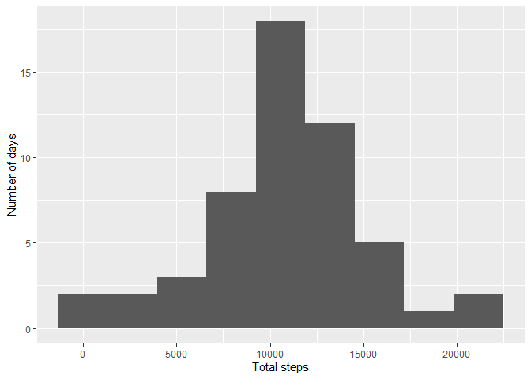
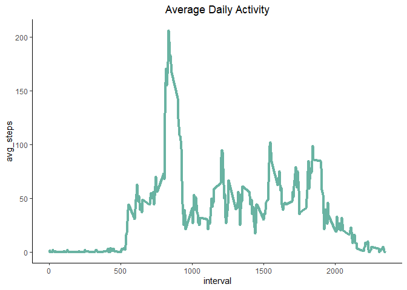
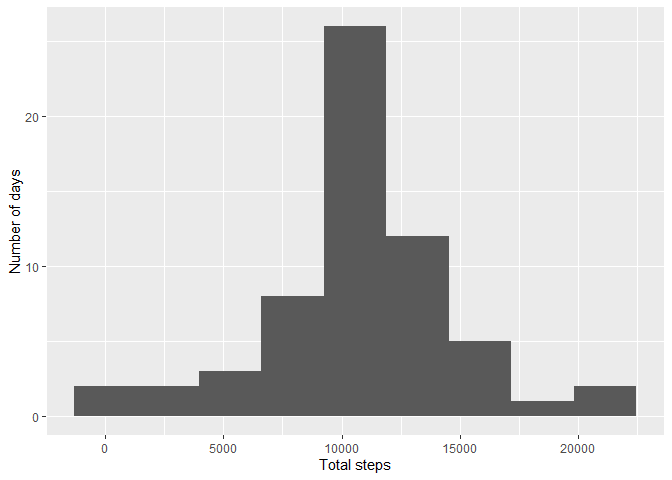
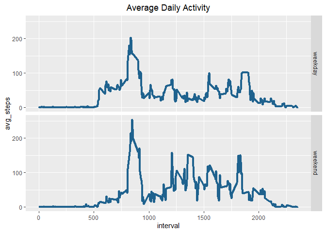

Load Libraries

```r
library(lubridate)
library(dplyr)
library(ggplot2)
library(skimr)
```


Load in and preprocess the data.

```r
data <- read.csv(unzip("activity.zip"))
data$date <- ymd(data$date)
```


## What is mean total number of steps taken per day?  

```r
df2 <- data %>% group_by(date) %>% summarise(stepsperday = sum(steps))
mean_steps <- round(mean(df2$stepsperday,na.rm=TRUE))
median_steps <- round(median(df2$stepsperday,na.rm=TRUE))
qplot(stepsperday,data=df2,bins=9,xlab="Total steps",ylab="Number of days",na.rm=TRUE)
```

<!-- -->

### The **mean** steps per day is 10766. The **median** steps per day is 10765.


## What is the average daily activity pattern?

```r
df3 <- data %>% group_by(interval) %>% summarise(avg_steps = as.numeric(round(mean(steps,na.rm=TRUE))))
ggplot(data=df3,aes(interval,avg_steps))+geom_line(color="#69b3a2",size=1.5)+theme_classic()+ ggtitle("Average Daily Activity")+theme(plot.title = element_text(hjust = 0.5))
```

<!-- -->

```r
max <- with(df3, interval[which.max(avg_steps)])
```

### The interval with maximum number of steps (avereged across all days) was interval **835**.


## Imputing missing values

```r
skimmed <- skim(data)
num_missing <- skimmed$n_missing[2]
```
### There are **2304** missing values in the dataset.  

Impute the missing values by using the mean for that 5 minute interval.

```r
df4 <- data %>% group_by(interval) %>% mutate(steps = ifelse(is.na(steps), mean(steps, na.rm = TRUE), steps)) %>% ungroup() 
df5 <- df4 %>% group_by(date) %>% summarise(stepsperday = sum(steps))
mean_steps_new <- round(mean(df5$stepsperday))
median_steps_new <- round(median(df5$stepsperday))
qplot(stepsperday,data=df5,bins=9,xlab="Total steps",ylab="Number of days")
```

<!-- -->

### The new **mean** steps per day after imputing is 10766. The new **median** steps per day after imputing is 10765. After imputing the missing data, the mean did not change and the median changed by one step. Imputing the mising values had essentially no impact on the daily step estimates.


## Are there differences in activity patterns between weekdays and weekends?

```r
df6 <- df4 %>% mutate(week = as.factor(ifelse(wday(df4$date) > 5, "weekend", "weekday"))) %>% group_by(interval,week) %>% summarise(avg_steps = round(mean(steps)),.groups="keep")
ggplot(data=df6,aes(interval,avg_steps))+geom_line(color="#1F628E",size=1.5)+facet_grid(week~.)+ggtitle("Average Daily Activity")+theme(plot.title = element_text(hjust = 0.5))
```

<!-- -->

